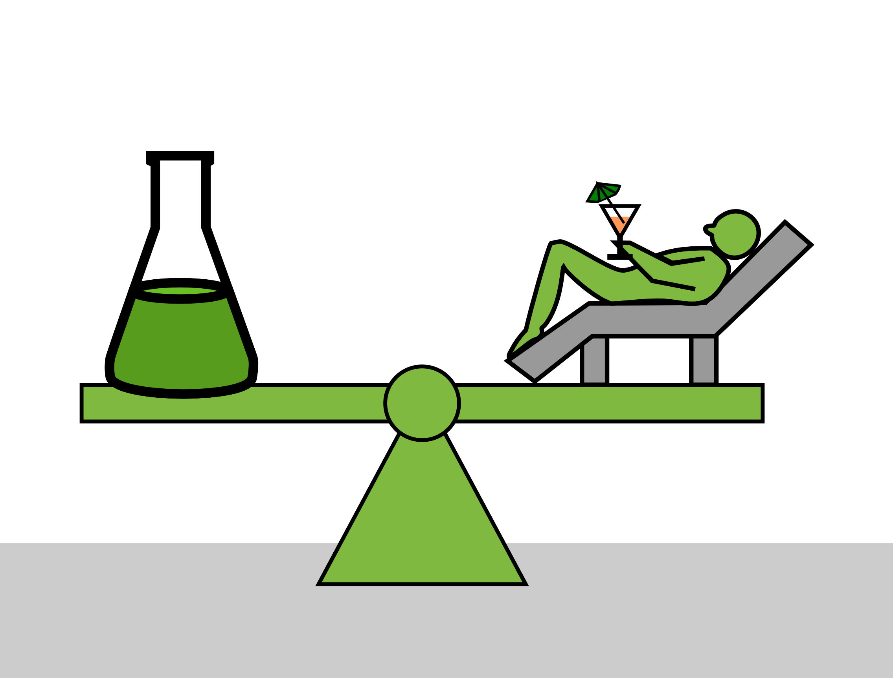

# Work-Life Balance

*Balancing means that you need to find a balance that works for you. E.g. if you have a heavy head you need to pour some liquid into the Erlenmeyer flask, and if you lift your feet, you need to take some liquid out.*

Balancing your work life and your private life and whatever other life you have is one of the keys to long-term success and happyness.

