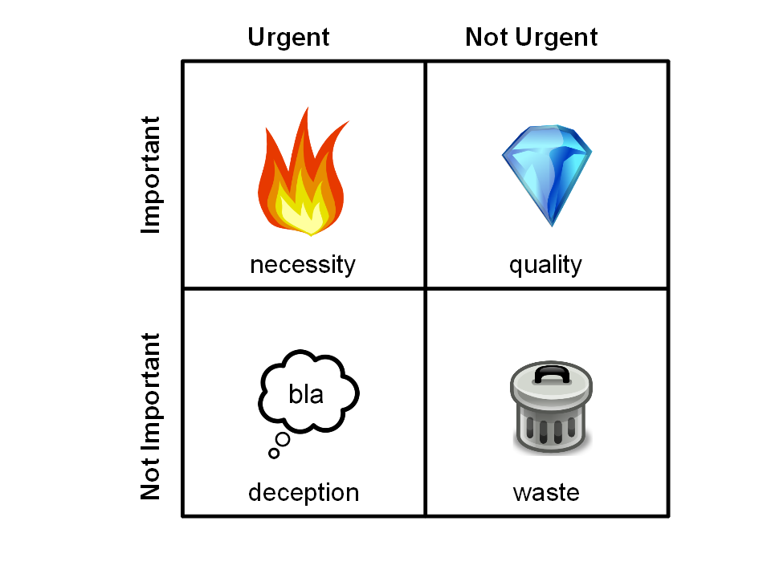

# Prioritizing with the Covey Matrix

Most probably, you have more to do than you would like to. This is normal for most people. But not everybody lives comfortably with that. The Covey Matrix is a tool that helps you **prioritize** your work and brings you back into charge.

## How it works:

Draw a table with four quadrants, and sort each of your tasks into one. The four quadrants are:

* **Necessity** (urgent and important): Emergencies, deadlines, well-prepared meetings. These need to be done first.
* **Quality** (important): Planning, implementation, and your own development. Maximize the time spent in this area, because it generates value in the long run.
* **Deception** (urgent): emails, paperwork, badly prepared meetings. Try to get rid of as much as possible.
* **Waste** (not urgent and not important): Browsing. Reading random posts on Facebook. Junk mails. Waste is toxic. Don't touch it! If you need a break, find yourself a distraction that has nothing to do with computers.

## Discussion

The Covey Matrix is a classic from time management. Its main purpose is prioritizing. Used consequently, it can make your work a lot more pleasant. Assigning tasks to the four quadrants is a good way to clean up a big list of tasks - your emails after vacations, to structure a work if you find it is a complete mess or a list of papers to read. You end up with four smaller heaps that are much easier to work with. 

You will typically find a lot of things in the *important/not urgent* category. This is why the Covey matrix alone is not so useful to prioritize your tasks on a day-to-day basis. An alternative would be to use a prioritized Todo-list or to divide tasks according to whether they are **easy or difficult** and **fun or boring**. That helps you think about how to fit in some important but difficult tasks into your schedule.

Also, the Covey matrix is insensitive to what you find important. Whether your goal is to be selfish or altruistic, the matrix helps you prioritize that. However, being aware of your own **value system** helps you to make the decision.
