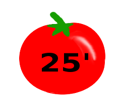

# Focus with Pomodoro

### Summary

Pomodoro(TM) makes more of your time when you have a lot to do.

### Time required

25 + 5 minutes

### What do you need?

* a timer (tomato shaped timers work best).
* sheets to record your tasks, activities, and results

### How does it work?

The **Pomodoro Technique®** by **Francesco Cirillo** is a time management technique that divides your work into small chunks. As the first thing in the morning, you write a list of all things you want to do. Then, you handle them in 25-minute units using a kitchen timer. The basic procedure is this:

* Set the alarm clock to 25 minutes.
* Start working on a task on your list. Add a tick for each 25-minute unit used on that task.
* When the alarm rings, take a 5-minute break.
* Record your progress and tasks that you have completed.
* Never stop the timer once it runs.

I find the Pomodoro Technique® particularly useful when writing longer texts. The fast-paced time keeps me focused and makes it easier to avoid distractions. I have also used the method to work on many other tasks, especially if they were urgent and annoying. On the Pomodoro(TM) website you can find a lot more details on the method: [http://www.pomodorotechnique.com](http://www.pomodorotechnique.com).
