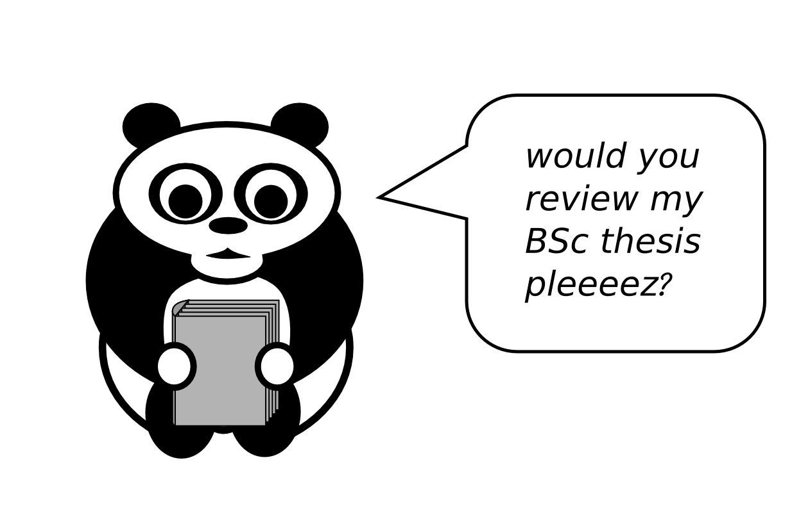

# Managing Tasks Exercise

## Goal

Use basic Time Management techniques to sort and prioritize typical laboratory tasks.

## Preparations

* Print the tasks in [exercise_covey_matrix.zip](exercise_covey_matrix.zip).
* Prepare one set of tasks per group (2-4 people)
* Print 4 or 9 tasks on one page

## 1. Covey Matrix

### The Task

Sort the tasks into the four quadrants of the Covey Matrix.

### Instructions

1. Present the Covey Matrix techniqe
2. Explain the task
3. Give the participants 5-7 minutes to complete the assignment
4. Ask some questions for debriefing

### Questions for Debriefing

* Can you give examples for urgent/important/urgent+important/nil tasks?
* Which tasks were easy to sort?
* What was difficult?
* In what situations do you think is the Covey Matrix useful?
* In what situations is it less useful?

## 2. Five Options

1. Highlight one task from the materials.
2. Ask for possible decisions.
3. Present the **Five Options** image and discuss how they apply in this case. If one option doesn't apply, find another example.
4. Resolve questions that occur.

## 3. Saying No

1. Present the **Ten Ways to say No** image
2. Ask participants to ask each other tasks from the set, and decline them one way or the other
3. After a couple of minutes, collect impressions.
